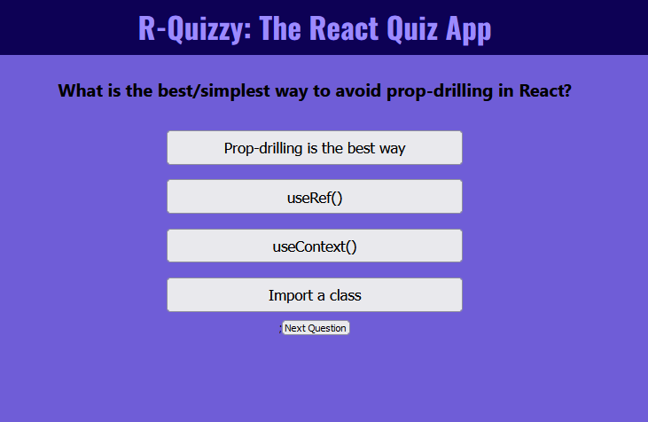

# Quiz App (In Progress)

React Practice Suite: #5
Stack: HTML, SCSS, React (JS).

Initial prototype:

## Styling

Like the majority of the React Practice Suite, I based the colouring on an animal. In this case, I used the "Purple Butterfly" colour scheme off Scheme Color (https://www.schemecolor.com/purple-butterfly.php).

This is implemented using the SCSS palette function (you can see the full palette used in the \_palette.scss file)

TO ADD:

-   Feedback to user
-   Completion screen with % correct
-   More styling
