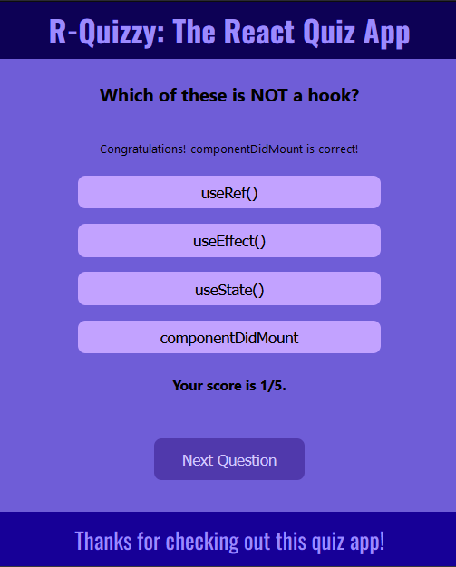
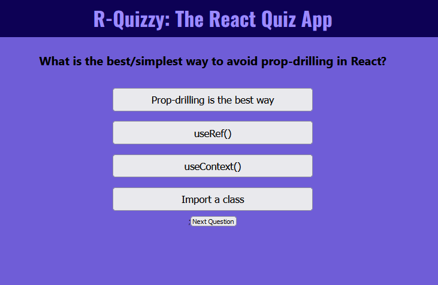

# Quiz App (In Progress)

## React Practice Suite: #5

### Stack:

HTML, SCSS, React (JS).

## Styling

Like the majority of the React Practice Suite, I based the colouring on an animal. In this case, I used the "Purple Butterfly" colour scheme off Scheme Color (https://www.schemecolor.com/purple-butterfly.php).

This is implemented using the SCSS palette function (you can see the full palette used in the \_palette.scss file)

## Added 31/10:

-   Styling of buttons and options
-   Added total score
-   Added calculation of incorrect/correct value

### Initial prototype from before these additions

## TO ADD

-   Victory screen at the end (after count >= questions.length) - potentially need React Router DOM for this, or just alternative styling using ternary operators.
-   Attempts to create more inuitive and modern user feedback (i.e. colouring of answers dependent on whether the answer was correct as opposed to just a line of text).
-   Hopefully can implement a mobile app (potentially with React Native?)
-   Ability to add questions by editing the context.
